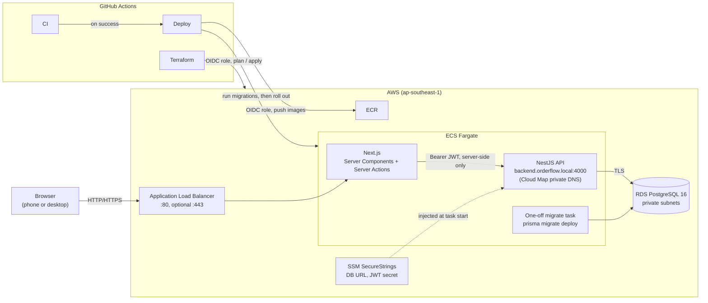

# OrderFlow

[](https://github.com/manimaran98/order-flow/actions/workflows/ci.yml)

OrderFlow tracks orders from first message to payment for Malaysian SMEs that take orders over WhatsApp and the phone. It keeps orders, stock, payments and fulfilment in one place, on a phone or a desktop. It is not a POS and not an accounting system. It has a NestJS API on PostgreSQL, a Next.js app, Docker images, a GitHub Actions pipeline, and Terraform that deploys it all to AWS ECS Fargate and RDS.

<!-- set after first deploy -->
Live demo: _URL added after deployment_

More detail: [product brief](OrderFlow_Malaysian_SME_MVP.md) · [backend design spec](docs/superpowers/specs/2026-09-29-orderflow-backend-foundation-design.md) · [frontend design spec](docs/superpowers/specs/2026-09-29-orderflow-frontend-design.md)

## What it does

- **Orders**: create, edit and track an order through `PENDING → CONFIRMED → PACKING → READY → DELIVERED`, or cancel it. Order numbers look like `ORD-20261008-0001` and use the Asia/Kuala_Lumpur date.
- **Stock**: confirming an order deducts stock and cancelling restores it. Every change is written to an inventory ledger, and low-stock products are flagged.
- **Payments**: partial and full payments. Payment status (`UNPAID` / `PARTIAL` / `PAID`) is derived from the amount paid, separately from the order status.
- **Customers**: search by name, phone or email, with each customer's order history.
- **Dashboard**: today's orders, the pipeline, unpaid orders with the amount outstanding, and low stock.
- **Users and roles**: the first account to register becomes ADMIN. ADMIN manages users, products and stock adjustments; STAFF runs the day-to-day work.
- **Public catalog**: `/catalog` shows active products and prices with no login, for sharing with customers.

## Tech stack

| Layer | Technology |
|---|---|
| Frontend | Next.js 16 (App Router, Server Actions, ISR), React 19, Tailwind CSS 4, shadcn/ui |
| Backend | NestJS 12 (ESM), TypeScript, Node 22, Swagger (OpenAPI) |
| Database | PostgreSQL 16, Prisma 7 (`@prisma/adapter-pg`), `pg_trgm` GIN indexes |
| Auth | JWT bearer tokens (8 h), ADMIN / STAFF roles, httpOnly session cookie on the frontend |
| Tests | Vitest, Supertest against a real Postgres, Testing Library, Playwright |
| Containers | Multi-stage Docker images running as non-root, Docker Compose for local and production-like runs |
| CI/CD | GitHub Actions: CI, deploy to ECS, Terraform plan/apply |
| Cloud | AWS: ALB, ECS Fargate, RDS PostgreSQL, ECR, SSM Parameter Store, Cloud Map, CloudWatch Logs, ACM |
| IaC | Terraform 1.13 with S3 remote state and `terraform test` |

## Architecture



The browser only ever talks to Next.js (a backend-for-frontend). Server Components and Server Actions call the API with the JWT read from an httpOnly cookie, so page scripts never see the token and the API has no public endpoint.

## Engineering highlights

Decisions worth a closer look, with where to find them.

- **Money is never a JS number.** Amounts are `Prisma.Decimal` built with `money()` (two decimal places) and serialised as strings like `"12.50"`. See [`backend/src/common/money.ts`](backend/src/common/money.ts).
- **No locks: guarded conditional updates, with CHECK constraints as the backstop.**
  - Confirming an order claims the row with `updateMany({ where: { id, status } })` and checks `count`, so the loser of a race gets a 409.
  - Stock is deducted with `WHERE stock_quantity >= q` inside the same transaction. If any line comes up short, the whole order rolls back, so the shop never oversells.
  - A payment is one guarded `UPDATE … WHERE paid_amount + amount <= total`, so an order can't be overpaid.
  - The database enforces the same rules with hand-written CHECK constraints (`stock_quantity >= 0`, `paid_amount <= total`, `total = subtotal - discount`, and others) in the [init migration](backend/prisma/migrations/20260929111727_init/migration.sql).
- **Order lifecycle as a small state machine.** `canTransition()` in [`order-rules.ts`](backend/src/orders/order-rules.ts) allows one step forward, or a cancel from any non-terminal status. Only `PENDING` orders can be edited or deleted. The rules are pure functions with their own unit tests.
- **Inventory ledger.** Every stock change goes through `InventoryService` and writes an `inventory_transactions` row in the same transaction. `stockQuantity` is never set directly.
- **A public catalog that builds without the API.** `/catalog` and `/catalog/[id]` use ISR (`revalidate = 300`) and a fetch that never reads cookies, so they stay static. Docker and CI run `next build` without an API, so at build time the list page renders a placeholder and each product page is generated on its first request. At runtime a failed fetch throws, so ISR keeps serving the last good page. The API side returns only public fields: `inStock`, never the stock count, cost price or SKU.
- **Query optimisation, measured.** On 200,000 orders and 20,000 customers, `EXPLAIN (ANALYZE, BUFFERS)` showed that order search joined every order to every customer. Two changes fixed it: rewrite the customer-name match as an indexed lookup plus `customer_id IN (...)`, and add `pg_trgm` GIN indexes. Results (median of 9 warm runs):
  - Order search by order number: 64.0 + 65.7 ms → 0.27 + 0.24 ms (rows + count)
  - Order search count for a common name: 151.8 ms → 3.1 ms
  - Customer search by phone digits: 10.6 + 10.5 ms → 0.07 + 0.05 ms
  - Dashboard unpaid total: 29.5 ms → 8.3 ms, by writing `IN (...)` instead of `<>` and adding no index

  The write-up also covers the write cost, the cases left unchanged, and a drift check: [docs/perf/query-optimisation.md](docs/perf/query-optimisation.md).
- **CI on every pull request.** Backend: lint, typecheck, build, unit tests and API e2e tests against a Postgres 16 service container. Frontend: lint, typecheck, unit tests and production build. Then the Playwright journey at phone and desktop sizes, and Docker builds of all three images (pushed to GHCR from `main`).
- **No stored AWS keys.** The Deploy and Terraform workflows assume IAM roles through GitHub OIDC. The deploy role Terraform creates can only push images and update the services.
- **Secrets stay out of Terraform state.** The DB password and JWT secret are Terraform `ephemeral` values, written to RDS and SSM through write-only arguments (`password_wo`, `value_wo`). ECS injects them at container start. To rotate them, bump `secrets_version`.
- **Safe rollouts.**
  - Migrations run as a one-off Fargate task (`backend-migrate` image) before the services update. If the migration fails, the deploy stops and the running version keeps serving.
  - The ECS deployment circuit breaker rolls a service back if its new tasks never become healthy.
- **HTTPS is optional, switched on with two variables.** Set `DOMAIN_NAME` (plus `ROUTE53_ZONE_ID` if the domain is on Route 53) and Terraform requests an ACM certificate. Once it's issued, set `HTTPS_ENABLED=true`: that adds a TLS 1.2/1.3 listener, redirects port 80 to HTTPS, and marks the session cookie `Secure`. `terraform test` checks both modes against a mocked AWS provider.
- **Health checks.** The API serves `/health`. The frontend's `/api/health` Route Handler always answers 200 and reports whether the API is up or down, so an API outage doesn't get healthy frontend containers killed. The Docker `HEALTHCHECK`s and the ALB target group use these endpoints.

## Testing

| Suite | Where | What it covers |
|---|---|---|
| Backend unit | `backend/src/**/*.spec.ts` | Pure rules: lifecycle, totals, payment status, order numbers, money and time helpers, Prisma error mapping |
| API e2e | `backend/test/*.e2e-spec.ts` | Every module through HTTP (Supertest) against the real `orderflow_test` database, with tables emptied before each test: auth and roles, customers, products, catalog, inventory, orders, status changes, payments, dashboard, input hardening, schema constraints |
| Frontend unit | `frontend/src/**/*.test.ts(x)` | Components, helpers, the proxy and the `/api/health` handler (Vitest + Testing Library) |
| Browser journey | `frontend/e2e/journey.spec.ts` | Playwright at desktop (1280×800) and phone (Pixel 7) sizes: a WhatsApp order taken all the way to paid, and a confirm that fails for lack of stock |

```bash
# backend/
npm test             # unit
npm run test:e2e     # API tests against orderflow_test

# frontend/
npm test             # unit
npm run test:e2e     # Playwright (see the note under Frontend development)
```

## Getting started

You need Docker with Compose. For work outside containers, you also need Node 22 and npm 11.

```bash
docker compose up --build
```

- App: http://localhost:3000 (log in, or create the first account)
- API: http://localhost:4000 · Swagger UI: http://localhost:4000/docs
- Postgres: localhost:5432 (`orderflow` / `orderflow`)

Demo data is optional. Skip it if you want to try first-user registration:

```bash
docker compose exec backend npm run seed
# admin@orderflow.local / Admin123!   staff@orderflow.local / Staff123!
```

## Development

### Backend

```bash
cd backend
cp .env.example .env
npm install
docker compose up -d postgres
npx prisma migrate deploy
npm run start:dev
```

| Command | What it does |
|---|---|
| `npm test` | Unit tests (pure rules, helpers) |
| `npm run test:e2e` | API tests against the `orderflow_test` database (tables emptied before each test) |
| `npm run lint` / `npm run typecheck` / `npm run build` | oxlint / tsc / compile |
| `npm run db:migrate` | Create and apply a migration in development |

### Frontend

```bash
cd frontend
cp .env.example .env.local   # API_URL=http://localhost:4000
npm install
npm run dev                  # http://localhost:3000
```

| Command | What it does |
|---|---|
| `npm test` | Component and helper tests (Vitest + Testing Library) |
| `npm run test:e2e` | Playwright journey at phone and desktop sizes. It starts its own backend (:4001) and app (:3001) against `orderflow_test`. Stop the compose `backend` and `frontend` containers first. |
| `npm run lint` / `npm run typecheck` / `npm run build` | ESLint / tsc / production build |

### Production images

`docker-compose.yml` is for development: hot reload with the source mounted. The production images are multi-stage builds that run as the non-root `node` user:

| Image | Dockerfile target | What it does |
|---|---|---|
| backend | `backend/Dockerfile` → `runtime` | Compiled API with production dependencies only. Health check on `/health`. |
| backend-migrate | `backend/Dockerfile` → `migrate` | One-off job: `prisma migrate deploy`, then exits. Run it before each backend release. |
| frontend | `frontend/Dockerfile` | Next.js standalone server. Health check on `/api/health`. `API_URL` is read at runtime, so one image serves every environment. |

To run them locally:

```bash
JWT_SECRET=$(openssl rand -hex 32) docker compose -f docker-compose.prod.yml up --build
docker compose -f docker-compose.prod.yml exec backend node dist/seed.js   # optional demo data
```

## Deployment

Three workflows run the pipeline:

1. **CI** ([`ci.yml`](.github/workflows/ci.yml)) runs on every pull request and every push to `main`.
2. **Deploy** ([`deploy.yml`](.github/workflows/deploy.yml)) runs when CI passes on `main`:
   1. Build the images and push them to ECR.
   2. Run migrations as a one-off Fargate task.
   3. Roll out the backend, then the frontend, waiting for each service to become stable.
3. **Terraform** ([`terraform.yml`](.github/workflows/terraform.yml)) runs for changes under `infra/aws/`. On a pull request it posts a plan; on merge to `main` it applies. You can also run it by hand to `destroy` the stack, which stops all AWS charges.

Both AWS workflows are skipped until their repository variables are set. [infra/aws/README.md](infra/aws/README.md) covers first-time setup, cost (about USD 50–60/month), rollback, secret rotation and adding HTTPS.

## Project structure

```
order-flow/
├── backend/                 NestJS API
│   ├── prisma/              schema.prisma and migrations
│   ├── src/                 auth, users, customers, products (+ catalog), inventory,
│   │                        orders, payments, dashboard, health, common helpers
│   └── test/                API e2e tests (Vitest + Supertest)
├── frontend/                Next.js app
│   ├── src/app/             (auth), (app) staff screens, (public)/catalog, api/health
│   ├── src/actions/         Server Actions (all mutations)
│   ├── src/lib/             server-only API client, session, helpers
│   └── e2e/                 Playwright journey
├── infra/aws/               Terraform: VPC, ALB, ECS, RDS, ECR, OIDC, HTTPS
├── docs/
│   ├── superpowers/         design specs and implementation plans
│   └── perf/                query benchmark, data set and results
├── .github/workflows/       ci.yml, deploy.yml, terraform.yml
├── docker-compose.yml       development stack
└── docker-compose.prod.yml  production images, run locally
```

Design docs: [specs](docs/superpowers/specs/) and [plans](docs/superpowers/plans/) for the backend and frontend, and the [query optimisation write-up](docs/perf/query-optimisation.md).
